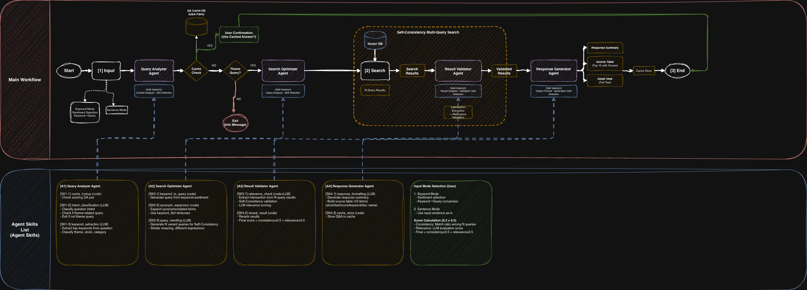

# Financial Report RAG Pipeline

A multi-agent RAG (Retrieval-Augmented Generation) system designed for Korean securities report search and Q&A generation.

## Overview

This pipeline processes user queries about financial themes and returns relevant information from securities reports with AI-generated summaries. The system uses Self-Consistency multi-query search to improve retrieval accuracy.

## Architecture

## Agents

### Query Analyzer Agent
- Cache lookup for existing Q&A pairs
- Intent classification to filter non-theme queries
- Keyword extraction for theme, stock, and category

### Search Optimizer Agent
- Keyword to query conversion with sentiment
- Synonym expansion using financial keyword dictionary
- Query rewriting for N variant queries (Self-Consistency)

### Result Validator Agent
- Intersection extraction from N query results
- Relevance scoring via LLM
- Final ranking: consistency × 0.5 + relevance × 0.5

### Response Generator Agent
- Response summary generation
- Source table with top 10 results
- Q&A caching for future queries

## Tech Stack

- Python
- FastAPI
- LLM API (GPT)
- Vector Database
- RAG Architecture

## Features

- **Dual input modes**: Keyword mode and Sentence mode
- **QA caching system** with user confirmation
- **Self-Consistency technique** for improved search accuracy
- **Graceful exit handling** for non-theme queries
